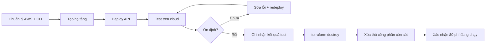

# Hướng dẫn chi tiết: Test trên AWS Cloud → Xóa toàn bộ tài nguyên

> **Mục đích:** Deploy Sports Field Booking System lên AWS **chỉ để test**, xác nhận hệ thống chạy ổn trên cloud, sau đó **xóa hết** để không phát sinh chi phí hàng tháng.

**Repo:** `Sports-Field-Booking-System`  
**Region khuyến nghị:** `ap-southeast-1` (Singapore)  
**Thời gian test điển hình:** 1–7 ngày  
**Ngân sách an toàn:** đặt Budget **$50–80** cho giai đoạn test ngắn (không cần $200 như production)

---

## 0. Tổng quan quy trình




| Giai đoạn             | Thời gian ước tính | Ai làm            |
| --------------------- | ------------------ | ----------------- |
| 0. Chuẩn bị           | 30–60 phút         | Bạn               |
| 1. Setup AWS account  | 30 phút            | Bạn               |
| 2. Sửa code cho cloud | 1–2 giờ            | AI (bạn review)   |
| 3. Tạo hạ tầng        | 20–40 phút         | AI + bạn approve  |
| 4. Deploy app         | 15–30 phút         | AI                |
| 5. Test trên cloud    | 1–3 ngày           | Bạn               |
| 6. Teardown (xóa hết) | 15–30 phút         | AI + bạn xác nhận |
| **Tổng**              | **~2–5 ngày**      |                   |


---


## 1. Kiến trúc tối giản cho mục đích TEST

Vì **không** chạy production lâu dài, bỏ các service tốn tiền/khó xóa không cần thiết:


| Service             | Dùng cho test? | Lý do                                                     |
| ------------------- | -------------- | --------------------------------------------------------- |
| ECS Fargate         | ✅              | Chạy API container                                        |
| ALB                 | ✅              | Truy cập API qua HTTPS/HTTP công khai                     |
| ECR                 | ✅              | Lưu Docker image                                          |
| RDS SQL Server      | ✅              | Khớp stack hiện tại (EF Core + Hangfire)                  |
| ElastiCache Redis   | ✅              | Slot lock + cache (bắt buộc theo code)                    |
| VPC + Subnet + SG   | ✅              | Bắt buộc                                                  |
| Secrets Manager     | ✅ (nhỏ)        | JWT + DB password                                         |
| CloudWatch Logs     | ✅              | Debug khi test                                            |
| **CloudFront**      | ❌              | Không cần — dùng URL ALB trực tiếp                        |
| **Route 53**        | ❌              | Không cần domain riêng                                    |
| **WAF**             | ❌              | Không cần cho test ngắn                                   |
| **S3 frontend**     | ❌              | Repo chưa có frontend                                     |
| **NAT Gateway × 2** | ❌              | Dùng **1 NAT** hoặc **public subnet cho ECS** (test ngắn) |


### Sơ đồ hạ tầng test

```
Postman / Browser
       │
       ▼
  [ ALB ]  ← URL dạng: sportbooking-test-xxxxx.ap-southeast-1.elb.amazonaws.com
       │
       ▼
  [ ECS Fargate: SportBooking.API ]  (1 task, 0.5 vCPU / 1GB)
       │
       ├──► [ RDS SQL Server ]     (db.t3.small — nhỏ nhất khả dụng)
       └──► [ ElastiCache Redis ]  (cache.t3.micro)
```

---


## 2. Phase 0 — Chuẩn bị trên máy local (Bạn)


### Bước 0.1 — Cài công cụ

- [x] **AWS CLI v2**: [https://docs.aws.amazon.com/cli/latest/userguide/getting-started-install.html](https://docs.aws.amazon.com/cli/latest/userguide/getting-started-install.html)
- [ ] **Docker Desktop** (đã có nếu chạy được `docker compose`)
- [ ] **.NET SDK 9**
- [ ] **Terraform** ≥ 1.5: [https://developer.hashicorp.com/terraform/install](https://developer.hashicorp.com/terraform/install)
- [ ] **Git**
- [ ] **Postman** (repo có `postman_environment.json`)

Kiểm tra:

```powershell
aws --version
docker --version
dotnet --version
terraform --version
```


### Bước 0.2 — Clone/mở project

```powershell
cd D:\download\Sports-Field-Booking-System-main\Sports-Field-Booking-System-main
```


### Bước 0.3 — Test local trước khi lên cloud (khuyến nghị)

```powershell
cd backend
docker compose up --build
```

- [ ] API chạy tại `http://localhost:8080`
- [ ] Swagger (nếu Development): `http://localhost:8080/swagger`
- [ ] Chạy unit test: `dotnet test SportBooking.sln`

> Nếu local fail, **đừng** deploy lên AWS — sửa local trước.


### Bước 0.4 — Đặt lịch nhắc xóa tài nguyên

- [ ] Đặt **calendar reminder** ngày kết thúc test (ví dụ: +3 ngày sau deploy)
- [ ] Ghi rõ: *"Hôm nay phải chạy terraform destroy"*

---


## 3. Phase 1 — Setup AWS Account (Bạn — làm 1 lần)


### Bước 1.1 — Tạo / đăng nhập AWS Account

- [ ] Truy cập [https://aws.amazon.com](https://aws.amazon.com)
- [ ] Bật **MFA** cho root account
- [ ] **Không** dùng root để deploy hàng ngày


### Bước 1.2 — Tạo IAM User admin (cho bạn)

1. IAM → Users → Create user: `sportbooking-admin`
2. Attach policy: `AdministratorAccess` *(chỉ user này của bạn, không cho AI)*
3. Tạo Access Key → lưu an toàn
4. Bật MFA cho user này


### Bước 1.3 — Cấu hình AWS CLI

```powershell
aws configure --profile sportbooking
# AWS Access Key ID: <admin key>
# AWS Secret Access Key: <admin secret>
# Default region: ap-southeast-1
# Default output: json
```

Kiểm tra:

```powershell
aws sts get-caller-identity --profile sportbooking
```


### Bước 1.4 — Tạo IAM User cho AI Agent (least privilege)

Tạo user `sportbooking-deploy-agent` với policy giới hạn:

```json
{
  "Version": "2012-10-17",
  "Statement": [
    {
      "Effect": "Allow",
      "Action": [
        "ec2:*",
        "ecs:*",
        "ecr:*",
        "elasticloadbalancing:*",
        "rds:*",
        "elasticache:*",
        "logs:*",
        "cloudwatch:*",
        "sns:*",
        "secretsmanager:*",
        "iam:CreateRole",
        "iam:DeleteRole",
        "iam:AttachRolePolicy",
        "iam:DetachRolePolicy",
        "iam:PutRolePolicy",
        "iam:DeleteRolePolicy",
        "iam:GetRole",
        "iam:PassRole",
        "iam:CreateServiceLinkedRole",
        "iam:List*",
        "iam:Get*",
        "sts:GetCallerIdentity"
      ],
      "Resource": "*",
      "Condition": {
        "StringEquals": {
          "aws:RequestedRegion": "ap-southeast-1"
        }
      }
    }
  ]
}
```

- [ ] **Không** gán `AdministratorAccess` cho AI
- [ ] Tạo access key riêng, chỉ dùng trong session deploy


### Bước 1.5 — AWS Budget (bảo vệ ví tiền)

1. AWS Billing → Budgets → Create budget
2. Cost budget: **$80/tháng** (đủ cho test vài ngày)
3. Alerts tại: **50%, 80%, 100%** → email của bạn
4. *(Tuỳ chọn)* Alert khi forecast vượt $60


### Bước 1.6 — Bật Cost Explorer

- [ ] AWS Billing → Cost Explorer → Enable (miễn phí)
- [ ] Dùng để kiểm tra sau khi destroy

---


## 4. Phase 2 — Chuẩn bị code cho cloud (AI + bạn review)

Các việc **bắt buộc** trước deploy:


| #   | Việc                                            | File liên quan       | Trạng thái |
| --- | ----------------------------------------------- | -------------------- | ---------- |
| 1   | Sửa Dockerfile `.NET 8` → `.NET 9`              | `backend/Dockerfile` | ✅          |
| 2   | Thêm health check endpoint                      | `SportBooking.API`   | ✅          |
| 3   | Cấu hình listen port 8080 trên container        | `Program.cs` / env   | ✅          |
| 4   | Tạo `appsettings.Staging.json` (không secrets)  | `SportBooking.API`   | ✅          |
| 5   | Secrets qua env/Secrets Manager, không hardcode | ECS task def         | ✅          |


> **Yêu cầu AI:** *"Sửa code Phase 2 trong AWS_CLOUD_TEST plan"* — AI sẽ thực hiện 5 mục trên.

---


## 5. Phase 3 — Tạo hạ tầng AWS (Terraform)


### Bước 3.1 — Cấu trúc thư mục (AI tạo) ✅

```
infra/
└── terraform/
    └── test-env/           # Môi trường test — destroy được 1 lệnh
        ├── versions.tf
        ├── variables.tf
        ├── outputs.tf
        ├── locals.tf
        ├── vpc.tf
        ├── ecs.tf
        ├── alb.tf
        ├── rds.tf
        ├── redis.tf
        ├── ecr.tf
        ├── secrets.tf
        ├── security-groups.tf
        └── terraform.tfvars.example
```

Scripts hỗ trợ (repo root):

```
scripts/
├── aws-test-init.ps1           # terraform init + plan
├── aws-test-deploy-api.ps1     # build, push ECR, deploy ECS
├── aws-test-wait-healthy.ps1   # chờ ALB + /health
├── aws-test-save-outputs.ps1   # lưu test-env-outputs.txt
└── aws-test-teardown-check.ps1 # kiểm tra resource còn sót
```

**Quy tắc đặt tên:** mọi resource có prefix `sportbooking-test-` để dễ tìm và xóa.

### Bước 3.2 — Biến Terraform (`terraform.tfvars`)

```hcl
project_name = "sportbooking-test"
aws_region   = "ap-southeast-1"
environment  = "test"

# ECS
ecs_cpu           = 512    # 0.5 vCPU
ecs_memory        = 1024   # 1 GB
ecs_desired_count = 1

# RDS SQL Server — size nhỏ nhất có thể
rds_instance_class = "db.t3.small"
rds_allocated_storage = 20

# Redis
redis_node_type = "cache.t3.micro"
```


### Bước 3.3 — Review trước khi tạo

```powershell
cd infra/terraform/test-env
$env:AWS_PROFILE = "sportbooking"
# Hoặc từ repo root:
.\scripts\aws-test-init.ps1
terraform plan -out=tfplan
```

**Trạng thái hiện tại:** Terraform đã `init` + `validate` thành công trên máy local. Chưa `apply` — cần AWS CLI + profile `sportbooking`.

**Bạn kiểm tra plan:**

- [ ] Chỉ tạo resource có prefix `sportbooking-test`
- [ ] Region = `ap-southeast-1`
- [ ] Không có resource ngoài danh sách Phase 3
- [ ] Ước tính chi phí ~$3–8/ngày (xem mục 10)


### Bước 3.4 — Apply (sau khi bạn approve)

```powershell
terraform apply tfplan
```

Chờ **20–40 phút** (RDS SQL Server tạo lâu nhất).

### Bước 3.5 — Lưu output quan trọng

Sau `apply`, lưu vào file local `test-env-outputs.txt` (không commit git):

```
ALB_URL          = http://sportbooking-test-xxxxx.ap-southeast-1.elb.amazonaws.com
ECR_REPO_URI     = 123456789.dkr.ecr.ap-southeast-1.amazonaws.com/sportbooking-test-api
ECS_CLUSTER      = sportbooking-test-cluster
ECS_SERVICE      = sportbooking-test-api
RDS_ENDPOINT     = sportbooking-test.xxxxx.ap-southeast-1.rds.amazonaws.com
REDIS_ENDPOINT   = sportbooking-test.xxxxx.cache.amazonaws.com
```

---


## 6. Phase 4 — Deploy ứng dụng lên ECS


### Bước 4.1 — Build & push Docker image

```powershell
cd backend
$env:AWS_PROFILE = "sportbooking"
$ACCOUNT_ID = (aws sts get-caller-identity --query Account --output text)
$ECR_URI = "$ACCOUNT_ID.dkr.ecr.ap-southeast-1.amazonaws.com/sportbooking-test-api"

aws ecr get-login-password --region ap-southeast-1 | docker login --username AWS --password-stdin "$ACCOUNT_ID.dkr.ecr.ap-southeast-1.amazonaws.com"

docker build -t sportbooking-test-api:latest .
docker tag sportbooking-test-api:latest "${ECR_URI}:latest"
docker push "${ECR_URI}:latest"
```


### Bước 4.2 — Cập nhật ECS service

```powershell
aws ecs update-service `
  --cluster sportbooking-test-cluster `
  --service sportbooking-test-api `
  --force-new-deployment `
  --profile sportbooking `
  --region ap-southeast-1
```


### Bước 4.3 — Chờ task healthy

```powershell
# Kiểm tra task đang chạy
aws ecs describe-services `
  --cluster sportbooking-test-cluster `
  --services sportbooking-test-api `
  --query "services[0].{running:runningCount,desired:desiredCount,events:events[0:3]}" `
  --profile sportbooking

# Kiểm tra ALB target healthy
aws elbv2 describe-target-health --target-group-arn <TARGET_GROUP_ARN> --profile sportbooking
```


### BưỂc 4.4 — Xem logs nếu lỗi

```powershell
aws logs tail /ecs/sportbooking-test-api --follow --profile sportbooking
```


### Bước 4.5 — Smoke test nhanh

```powershell
$ALB = "http://sportbooking-test-xxxxx.ap-southeast-1.elb.amazonaws.com"

# Health check
Invoke-RestMethod -Uri "$ALB/health"

# Swagger (nếu Staging bật)
Start-Process "$ALB/swagger"
```

---


## 7. Phase 5 — Test trên cloud (Bạn)


### Bước 5.1 — Cấu hình Postman

1. Import collection API (nếu có) hoặc dùng Swagger
2. Sửa `postman_environment.json`:
  - `baseUrl` = URL ALB (không có `/` cuối)
3. Test theo thứ tự:


| #   | Test case          | Endpoint                  | Kỳ vọng                               |
| --- | ------------------ | ------------------------- | ------------------------------------- |
| 1   | Health             | `GET /health`             | 200 OK                                |
| 2   | Register           | `POST /api/auth/register` | 201, trả user                         |
| 3   | Login              | `POST /api/auth/login`    | 200, trả JWT                          |
| 4   | List venues        | `GET /api/venues`         | 200, có data seed                     |
| 5   | Available slots    | `GET /api/slots/...`      | 200                                   |
| 6   | Create booking     | `POST /api/bookings`      | 201, slot bị hold                     |
| 7   | Payment            | `POST /api/payments`      | 200/201                               |
| 8   | Hangfire job       | Đợi 5 phút                | Booking chưa pay bị cancel            |
| 9   | Concurrent booking | 2 request cùng slot       | 1 thành công, 1 conflict (Redis lock) |


### Bước 5.2 — Test ổn định theo thời gian

Chạy test trong **ít nhất 24–48 giờ** để xác nhận:

- [ ] ECS task không bị restart liên tục
- [ ] Hangfire jobs chạy đúng lịch (slot generation daily, cancel every 5 min)
- [ ] Không memory leak (CloudWatch memory ổn định)
- [ ] RDS connection pool ổn (không timeout)
- [ ] Redis lock hoạt động khi có nhiều request


### Bước 5.3 — Ghi nhận kết quả test

Tạo file `CLOUD_TEST_RESULTS.md` (local, không cần commit):

```markdown
# Kết quả test cloud — SportBooking
Ngày test: 2026-07-06 → 2026-07-08
ALB URL: http://...
Kết quả: PASS / FAIL

## Test cases
- [x] Auth flow
- [x] Booking flow
- [x] Redis lock
- [x] Hangfire jobs
- [ ] ...

## Issues found
- (none / list)

## Kết luận
Hệ thống ổn định trên cloud → tiến hành teardown.
```

---


## 8. Phase 6 — Xác nhận sẵn sàng xóa (Bạn)

**Chỉ teardown khi:**

- [ ] Tất cả test case quan trọng **PASS**
- [ ] Đã ghi nhận kết quả vào `CLOUD_TEST_RESULTS.md`
- [ ] Không còn cần debug thêm trên cloud
- [ ] Đã backup dữ liệu test (nếu cần) — thường **không cần** vì chỉ là test

**Nói với AI:** *"Test đã pass, tiến hành teardown toàn bộ AWS resources"*

---


## 9. Phase 7 — XÓA TOÀN BỘ TÀI NGUYÊN (Teardown)

> ⚠️ **Thao tác không thể hoàn tác.** RDS snapshot mặc định có thể bị xóa theo. Đảm bảo đã test xong.


### Bước 7.1 — Dừng ECS service trước (giảm chi phí ngay)

```powershell
aws ecs update-service `
  --cluster sportbooking-test-cluster `
  --service sportbooking-test-api `
  --desired-count 0 `
  --profile sportbooking `
  --region ap-southeast-1
```


### Bước 7.2 — Terraform destroy (xóa phần lớn)

```powershell
cd infra/terraform/test-env
$env:AWS_PROFILE = "sportbooking"
terraform destroy
```

Gõ `yes` khi được hỏi.

**Thứ tự destroy tự động (Terraform lo):**

1. ECS service & task definition
2. ALB & target groups
3. ElastiCache cluster
4. RDS instance *(có thể mất 10–15 phút)*
5. ECR repository
6. Secrets Manager secrets
7. CloudWatch log groups
8. VPC, subnets, security groups, NAT gateway
9. IAM roles do Terraform tạo


### Bước 7.3 — Xóa thủ công những gì Terraform có thể sót

Sau `terraform destroy`, kiểm tra từng mục:

#### 9.3.1 — ECR images

```powershell
aws ecr describe-repositories --profile sportbooking --region ap-southeast-1 `
  --query "repositories[?contains(repositoryName,'sportbooking')]"
# Nếu còn:
aws ecr delete-repository --repository-name sportbooking-test-api --force --profile sportbooking
```


#### 9.3.2 — CloudWatch Log Groups

```powershell
aws logs describe-log-groups --profile sportbooking --region ap-southeast-1 `
  --log-group-name-prefix "/ecs/sportbooking"
# Nếu còn:
aws logs delete-log-group --log-group-name "/ecs/sportbooking-test-api" --profile sportbooking
```


#### 9.3.3 — Secrets Manager

```powershell
aws secretsmanager list-secrets --profile sportbooking --region ap-southeast-1 `
  --filters Key=name,Values=sportbooking
# Nếu còn (force delete không cần recovery window):
aws secretsmanager delete-secret --secret-id sportbooking-test/db --force-delete-without-recovery --profile sportbooking
```


#### 9.3.4 — RDS snapshots (tốn tiền nếu sót!)

```powershell
aws rds describe-db-snapshots --profile sportbooking --region ap-southeast-1 `
  --query "DBSnapshots[?contains(DBSnapshotIdentifier,'sportbooking')]"
# Xóa từng snapshot:
aws rds delete-db-snapshot --db-snapshot-identifier <snapshot-id> --profile sportbooking
```


#### 9.3.5 — Elastic IPs (NAT xóa nhưng EIP có thể sót)

```powershell
aws ec2 describe-addresses --profile sportbooking --region ap-southeast-1 `
  --query "Addresses[?Tags[?Value=='sportbooking-test']]"
# Release nếu còn:
aws ec2 release-address --allocation-id <eip-alloc-id> --profile sportbooking
```


#### 9.3.6 — IAM roles/policies do Terraform tạo

```powershell
aws iam list-roles --profile sportbooking `
  --query "Roles[?contains(RoleName,'sportbooking-test')]"
# Xóa nếu còn (detach policy trước)
```


#### 9.3.7 — Xóa IAM deploy agent (tuỳ chọn)

Nếu không dùng nữa:

- [ ] Deactivate access key của `sportbooking-deploy-agent`
- [ ] Xóa user hoặc giữ lại cho lần test sau


### Bước 7.4 — Xóa credentials local

- [ ] Xóa `test-env-outputs.txt`
- [ ] Xóa AWS access key deploy agent (rotate nếu đã lộ)
- [ ] Không commit secrets vào git

---


## 10. Phase 8 — Xác nhận đã xóa sạch (Bạn)


### Checklist sau destroy

- [ ] `terraform destroy` exit code 0
- [ ] ECS: không còn cluster `sportbooking-test`
- [ ] RDS: không còn instance `sportbooking-test`
- [ ] ElastiCache: không còn cluster
- [ ] ALB: không còn load balancer
- [ ] ECR: repository đã xóa
- [ ] NAT Gateway: không còn (hoặc 0 NAT trong VPC test)
- [ ] RDS snapshots: **0 snapshot** còn lại
- [ ] Elastic IPs: **0 EIP** unassociated (EIP idle tốn $3.6/tháng!)
- [ ] Secrets Manager: 0 secret test
- [ ] CloudWatch Logs: 0 log group test


### Kiểm tra chi phí

1. AWS Console → **Billing Dashboard** → xem chi phí hôm nay
2. Cost Explorer → filter service → xác nhận không còn RDS/ECS/ElastiCache charges **từ ngày mai**
3. Sau **48 giờ**, chi phí daily về ~$0 (chỉ còn Cost Explorer miễn phí)

> Lưu ý: AWS billing trễ 24–48h. Chi phí ngày test vẫn hiện nhưng **không phát sinh thêm** sau destroy.

---


## 11. Chi phí ước tính (test ngắn hạn)


| Resource                   | Chi phí/ngày (ước tính) |
| -------------------------- | ----------------------- |
| RDS SQL Server db.t3.small | ~$1.5–3.5               |
| ECS Fargate 0.5vCPU/1GB    | ~$0.5–1                 |
| ElastiCache t3.micro       | ~$0.4                   |
| ALB                        | ~$0.6                   |
| NAT Gateway                | ~$1.1 + data transfer   |
| CloudWatch Logs            | ~$0.1                   |
| Secrets Manager            | ~$0.1                   |
| **Tổng/ngày**              | **~$4–7**               |


| Thời gian test | Chi phí ước tính |
| -------------- | ---------------- |
| 1 ngày         | ~$5–8            |
| 3 ngày         | ~$15–25          |
| 7 ngày         | ~$35–55          |


> **Mẹo tiết kiệm:** Test xong trong **1–3 ngày**, destroy ngay. NAT Gateway và RDS là 2 khoản tốn nhất.

---


## 12. Workflow làm việc với AI Agent


### Lần 1 — Deploy

```
Bạn: "Setup AWS xong rồi, bắt đầu Phase 2-4 theo AWS_CLOUD_TEST plan"
AI:  Sửa code → tạo Terraform → terraform plan → gửi bạn review
Bạn: "Approve plan"
AI:  terraform apply → build Docker → push ECR → deploy ECS → smoke test
AI:  Gửi ALB URL + deployment report
Bạn: Test theo Phase 5 (1-3 ngày)
```


### Lần 2 — Teardown

```
Bạn: "Test pass, xóa hết resources"
AI:  Scale ECS về 0 → terraform destroy → chạy cleanup script
AI:  Gửi teardown report + checklist Phase 8
Bạn: Xác nhận billing sau 48h
```


### Lần 3 — (Tuỳ chọn) Test lại sau này

Giữ lại:

- AWS account + IAM admin
- Terraform code trong repo (`infra/terraform/test-env/`)

Chạy lại từ Phase 3 (`terraform apply`) — infrastructure có thể tái tạo trong ~30 phút.

---


## 13. Troubleshooting thường gặp


| Vấn đề                   | Nguyên nhân                      | Cách xử lý                                    |
| ------------------------ | -------------------------------- | --------------------------------------------- |
| ECS task liên tục stop   | DB/Redis connection fail         | Kiểm tra SG, secrets, env vars trong logs     |
| ALB 502/503              | Task chưa healthy                | Xem `/health`, tăng health check grace period |
| RDS connection timeout   | SG chưa mở 1433 từ ECS SG        | Sửa SG rule trong Terraform                   |
| Redis timeout            | ElastiCache trong private subnet | Kiểm tra ECS và Redis cùng VPC                |
| `terraform destroy` fail | RDS deletion protection          | Tắt `deletion_protection = false` trong tf    |
| Destroy xong vẫn có phí  | RDS snapshot / EIP sót           | Chạy checklist mục 9.3                        |
| Chi phí cao bất thường   | Quên destroy NAT/RDS             | Destroy ngay, check Cost Explorer             |


---


## 14. Checklist tổng hợp (in ra theo dõi)


### Trước deploy

- [ ] Test local pass (`docker compose up`)
- [ ] AWS CLI configured
- [ ] Budget alert bật
- [ ] Calendar reminder teardown đã đặt


### Deploy

- [x] Code Phase 2 hoàn thành
- [ ] `terraform plan` reviewed & approved
- [ ] `terraform apply` success
- [ ] Docker pushed to ECR
- [ ] ECS task RUNNING + ALB healthy
- [ ] Smoke test pass


### Test

- [ ] Auth / Booking / Payment flow pass
- [ ] Redis lock test pass
- [ ] Hangfire jobs verified (24h+)
- [ ] `CLOUD_TEST_RESULTS.md` ghi nhận PASS


### Teardown

- [ ] ECS scaled to 0
- [ ] `terraform destroy` success
- [ ] Manual cleanup (ECR, snapshots, EIP, logs)
- [ ] Checklist Phase 8 all checked
- [ ] Billing verified after 48h

---


## 15. Bước tiếp theo ngay bây giờ


### Đã xong (AI)

- [x] **Phase 2** — Code cloud-ready (Dockerfile .NET 9, `/health`, port 8080, Staging config, Secrets Manager)
- [x] **Phase 3 (code)** — Terraform `test-env` + scripts deploy/teardown
- [x] `terraform validate` pass


### Bạn cần làm tiếp

1. **Cài AWS CLI v2** + **Terraform** (hoặc dùng `scripts/tools/terraform.exe` đã tải sẵn)
2. **Phase 1** — `aws configure --profile sportbooking` + Budget alert
3. **Bật Docker Desktop**
4. Chạy `.\scripts\aws-test-init.ps1` → review plan → `terraform apply tfplan`
5. Chạy `.\scripts\aws-test-deploy-api.ps1` → test theo Phase 5
6. Sau test pass: *"Teardown theo Phase 7"*

---

*Tài liệu này dành riêng cho mục đích test tạm trên AWS. Không áp dụng cho production lâu dài.*